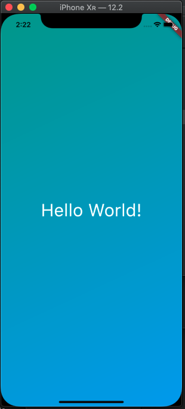

# hello_world

Ứng dụng hiển thị ra màn hình câu: "Chào thế giới"

- Ứng dụng Flutter luôn phải trả về một Material App
- Material App này có thuộc tính:
    - title: Tên app
    - home: Quy định màn chạy đầu tiên

