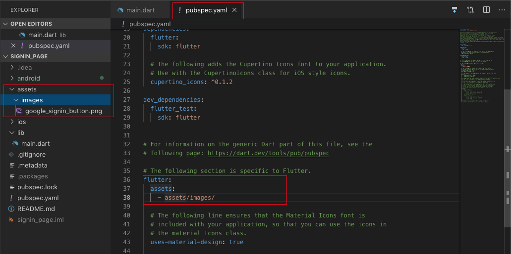

# signin_page

    - signin_page hiển thị ra một đoạn Text và một button (button này sử dụng ảnh) đăng nhập bằng Google

## Sử dụng ảnh:
    - Tạo thư mục assets
    - Trong assets tạo thư mục images
    - Thêm image bạn dùng vào thư mục images
    - Sửa file pubspec.yaml

```
    flutter:
    assets:
    - assets/images/
```

Xem hình:
