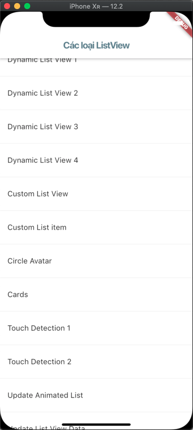

# demo_list_view

## Tap vào các row để xem chi tiết ví dụ về ListView

## Static List View 1

- Sử dụng ListTile() trả về các trường hiển thị dạng list

## Static List View 2

- Sử dụng ListTile.divideTiles() trả về một list có các trường ngăn cách nhau bởi dấu gạch

## Dynamic List View 1

- Sử dụng ListView.builder() hiển thị danh sách từ một mảng có sẵn với 2 thuộc tính là itemCount, itemBuilder

## Dynamic List View 2

- Sử dụng ListView.builder() hiển thị danh sách không giới hạn phần tử

## Dynamic List View 3 

- Sử dụng ListView.separated() hiển thị danh sách với các phần tử ngăn cách nhau bởi một dấu gạch

## Dynamic List View 4

- Sử dụng scrollDirection trong ListView để hiển thị danh sách theo chiều ngang

## Custom List View

- Trả về một list các Tile được custom

## Custom List Item

- Trả về một danh sách hiển thị thành 2 cột

## Circle Avatar 

- Sử dụng Widget CircleAvatar để hiển thị ảnh hình tròn

## Cards

- Trả về một danh dánh icon và text

## Touch Detection 1

- Sử dụng onTap() trong ListTile()

## Touch Detection 2

- Sử dụng onTap() trong InkWell()

## Update Animated List

- Nhấn vào nút để thêm, sử dụng AnimatedListState

## Update List View Data

- Nhấn vào phần tử để thêm

# Tổng kết

- ListView trong Flutter là một danh sách tuyến tính của các mục có thể cuộn
- ListView có thể hiển thị theo chiều dọc, hoặc ngang
- Các loại ListView thường dùng:
    - ListView()
    - ListView.builder()
    - ListView.separated()
    - ListView.custom()
