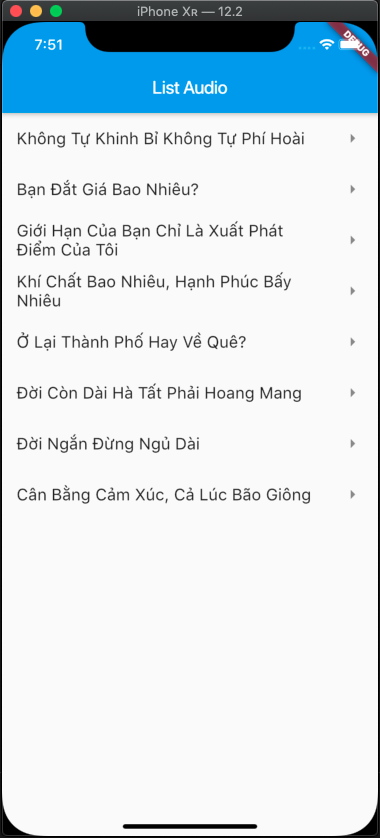
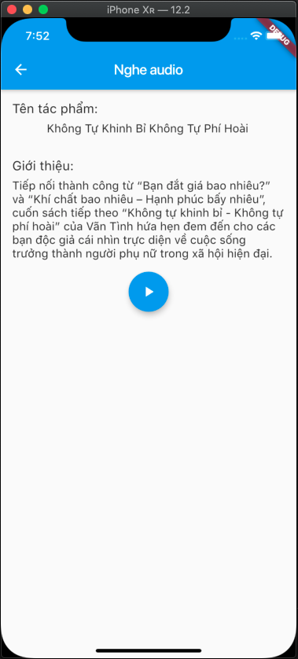

# list_audio

Ứng dụng nghe truyện online

- Lấy dữ liệu từ API:
Cấu trúc dữ liệu như sau:
```
{
	"resultCount": 10,
	"result": [
		{
			"id": "1",
			"name": "",
			"description": "",
			"audioURL": "https://file.mp3"
		},
		{
			"id": "2",
			"name": "",
			"description": "",
			"audioURL": "https://file.mp3"
		},
		{
			"id": "3",
			"name": "",
			"description": "",
			"audioURL": "https://file.mp3"
		}
	]
}
```
- Sử dụng thư viện audioplayers để tương tác với audio
```
import 'package:audioplayers/audioplayers.dart';
  AudioPlayer audioPlayer = AudioPlayer();

  play() async {
    await audioPlayer.play(widget.audio.audioURL);
  }

  stop() async {
    await audioPlayer.stop();
  }
```
<td>
  
</td>
<td>
  
</td>
</tr>
  </table>

